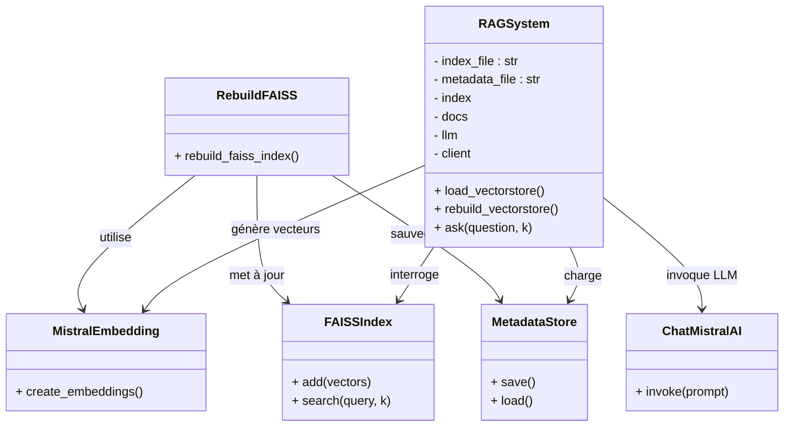

```mermaid
classDiagram
    %% Classes principales du système RAG

    class RebuildFAISS {
        + rebuild_faiss_index()
    }

    class RAGSystem {
        - index_file : str
        - metadata_file : str
        - index
        - docs
        - llm
        - client
        + load_vectorstore()
        + rebuild_vectorstore()
        + ask(question, k)
    }

    class FAISSIndex {
        + add(vectors)
        + search(query, k)
    }

    class MetadataStore {
        + save()
        + load()
    }

    class MistralEmbedding {
        + create_embeddings()
    }

    class ChatMistralAI {
        + invoke(prompt)
    }

    %% Relations entre classes
    RebuildFAISS --> MistralEmbedding : utilise
    RebuildFAISS --> FAISSIndex : met à jour
    RebuildFAISS --> MetadataStore : sauvegarde

    RAGSystem --> FAISSIndex : interroge
    RAGSystem --> MetadataStore : charge
    RAGSystem --> MistralEmbedding : génère vecteurs
    RAGSystem --> ChatMistralAI : invoque LLM
```
