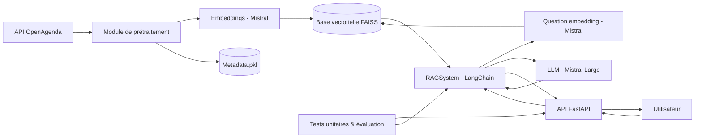

```mermaid
flowchart LR
    %% =========================
    %% Données entrantes
    %% =========================
    OA[API OpenAgenda] --> PRE[Module de prétraitement]

    %% =========================
    %% Prétraitement & Indexation
    %% =========================
    PRE --> EMB[Embeddings - Mistral]
    EMB --> FAISS[(Base vectorielle FAISS)]
    PRE --> META[(Metadata.pkl)]

    %% =========================
    %% Système RAG
    %% =========================
    USER[Utilisateur] --> API[API FastAPI]

    API --> RAG[RAGSystem - LangChain]

    %% Étape clé : transformation question en vecteur
    RAG --> QEMB[Question embedding - Mistral]
    QEMB --> FAISS
    FAISS --> RAG

    %% Génération via LLM après récupération des documents
    RAG --> LLM[LLM - Mistral Large]
    LLM --> RAG

    RAG --> API
    API --> USER

    %% =========================
    %% Tests
    %% =========================
    TESTS[Tests unitaires & évaluation] --> API
    TESTS --> RAG

```
