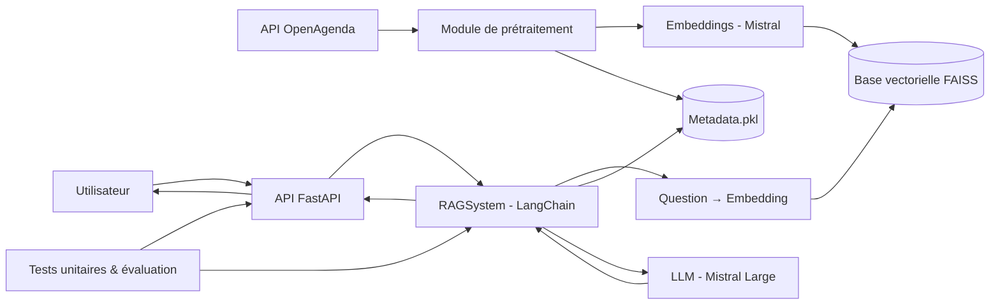

```mermaid
flowchart LR
    %% =========================
    %% Données entrantes
    %% =========================
    OA[API OpenAgenda] --> PRE[Module de prétraitement]

    %% =========================
    %% Prétraitement & Indexation
    %% =========================
    PRE --> EMB[Embeddings - Mistral]
    EMB --> FAISS[(Base vectorielle FAISS)]
    PRE --> META[(Metadata.pkl)]

    %% =========================
    %% Système RAG
    %% =========================
    USER[Utilisateur] --> API[API FastAPI]
    API --> RAG[RAGSystem - LangChain]
    RAG --> QV[Question → Embedding]
    QV --> FAISS
    RAG --> META
    RAG --> LLM[LLM - Mistral Large]
    LLM --> RAG
    RAG --> API
    API --> USER

    %% =========================
    %% Tests
    %% =========================
    TESTS[Tests unitaires & évaluation] --> API
    TESTS --> RAG

```
