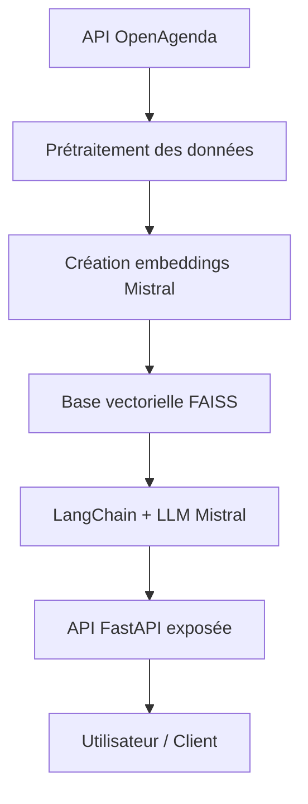

````markdown
#  Assistant intelligent de recommandation d’événements culturels

Ce projet propose un **assistant conversationnel** capable de recommander des événements culturels à partir d’une base de données publique (OpenAgenda) et d’un **modèle LLM intégré via LangChain et FAISS**.  

L’utilisateur peut poser des questions en langage naturel et recevoir des réponses synthétiques et contextualisées.

---

##  Fonctionnalités

- Recherche d’événements pertinents via **similarité sémantique**.
- Génération de réponses structurées à partir d’un **LLM** (Mistral AI).  
- Base vectorielle **FAISS** pour un accès rapide aux événements.  
- **API REST** exposée avec endpoints `/ask`, `/rebuild`, `/health`, `/metadata`.  
- Conteneurisation **Docker** pour un déploiement simple et reproductible.

---

## Architecture



* **Prétraitement** : nettoyage des champs, normalisation des dates, génération d’un texte contextuel.
* **Embeddings** : Mistral Embed API, vecteurs float32.
* **Vectorstore** : FAISS (IndexFlatL2) avec métadonnées associées.
* **LLM** : Mistral-large-latest intégré via LangChain.
* **API** : FastAPI, exposant les endpoints pour poser des questions et reconstruire la base.

---

##  Prérequis

* Python 3.12
* Docker & Docker Compose
* Clé API **Mistral AI** (dans `.env`)

---

##  Installation et exécution

### 1. Cloner le projet

```bash
git clone https://github.com/ton-repo/projet7.git
cd projet7
```

### 2. Créer le fichier `.env`

```env
MISTRAL_API_KEY=ton_api_key_mistral
```

### 3. Build et lancer le conteneur Docker

```bash
docker build -t rag_app .
docker run -p 8000:8000 rag_app
```

L’API sera disponible sur : `http://127.0.0.1:8000`

---

##  Endpoints principaux

### `/ask` : poser une question

**Requête :**

```json
{
  "question": "Quels concerts à Lille ce week-end ?"
}
```

**Réponse :**

```json
{
  "answer": "Concerts à Lille ...",
  "retrieved_events": [
    {
      "title": "Festival du court-métrage",
      "city": "Lille",
      "start": "22 March 2025",
      "end": "22 March 2025"
    }
  ]
}
```

### `/rebuild` : reconstruire la base vectorielle

**Requête :**

```json
{
  "x-api-key": "votre_cle_secrete"
}
```

**Réponse :**

```json
{
  "status": "success",
  "message": "Base vectorielle reconstruite"
}
```

### `/health` et `/metadata`

* Vérification de l’état de l’API et informations générales (uptime, version…).

---

##  Tests unitaires

* Fichiers de tests : `app/test/test_rag.py`
* Tests principaux :

  * Scores de similarité et coverage entre 0 et 1
  * Vérification des réponses non vides
* Pour exécuter les tests (avec le CSV déjà généré) :

```bash
pytest app/test/test_rag.py --maxfail=1 --disable-warnings -v
```

---

##  Arborescence du projet

```
projet7/
├─ app/
│  ├─ api/
│  │  └─ endpoints.py
│  ├─ rag/
│  │  ├─ rag_system.py
│  │  └─ rebuild_faiss.py
│  ├─ app_streamlit.py
│  ├─ main.py
│  └─ exceptions.py
├─ test/
│  ├─ evaluate_rag.py
│  ├─ test_rag.py
│  └─ gold_answers.csv
├─ faiss_index_openagenda.idx
├─ metadata_openagenda.pkl
├─ requirements.txt
├─ Dockerfile
└─ README.md
```

---

##  Résultats & Évaluation

* Jeu de test annoté avec 20 questions représentatives.
* Scores de similarité sémantique et couverture évalués via RAGas.
* Analyse qualitative : réponses pertinentes, contextuelles et synthétiques.

---

##  Perspectives

* Filtrage dynamique par date et lieu
* Mise en cache des embeddings pour accélérer les requêtes
* Passage à FAISS HNSW pour de meilleures performances sur de gros volumes
* Déploiement cloud pour production

---
````

